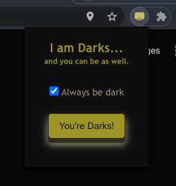

# Darks

Chrome extension that transforms a webpage into a rough dark mode.

It is inspirated by the dev.to article [Dark Mode with only 1 CSS PROPERTY](https://dev.to/dip15739/dark-mode-with-only-1-css-property-17fl)

## Disclaimer

Web pages can be built in many different ways so this extension is not a silver bullet for everypage.

## Contributing
If you know how to improve or extend this project, you are more than welcome to contribute.
1. Fork this repo
2. Open a PR request.
3. Submit your PR & get it reviewed.
4. Your PR is merged! (Hopefully 🤞🏼)

## License
This project is distributed under the MIT License - see the [LICENSE.txt](LICENSE.txt) file for details.

---
_The name comes from [Verónica Rodriguez de la Luz del Topo a.k.a. La Elvira](https://www.youtube.com/watch?v=nidyBSVfSZ0)_
